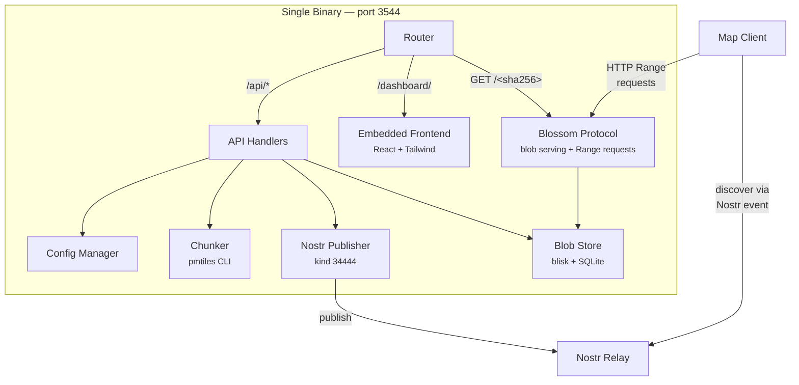
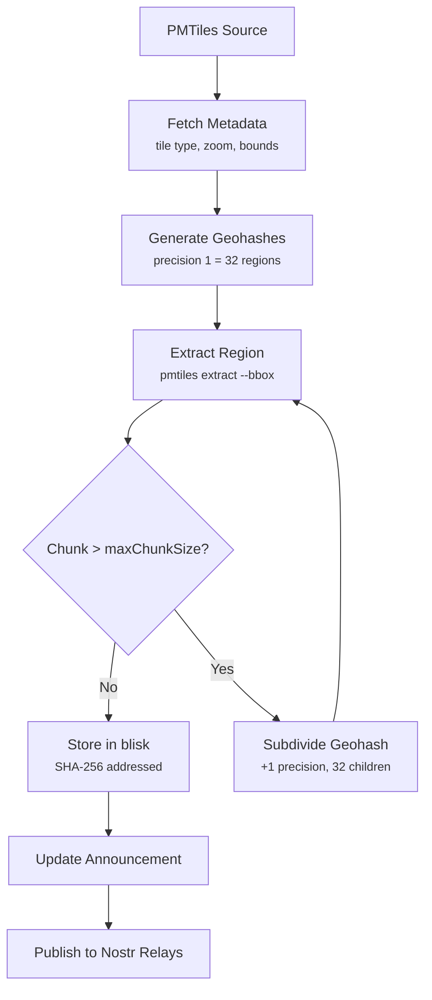
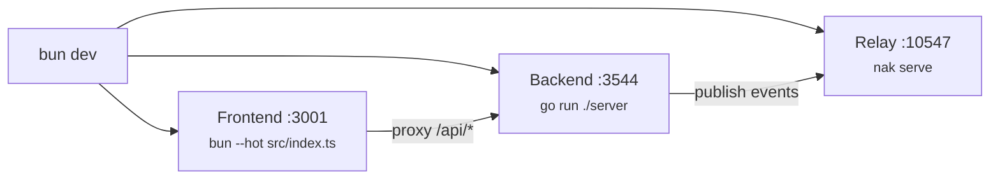

# blosmap

A geospatial data server that chunks [PMTiles](https://pmtiles.io/) map archives into geographic regions, stores them as content-addressed blobs via the [Blossom](https://github.com/hzrd149/blossom) protocol, and announces them over [Nostr](https://nostr.com/) for decentralized map tile discovery.

## How It Works


A PMTiles file contains an entire map tileset in a single archive. blosmap splits it into **geohash-based chunks** — each chunk is a standalone `.pmtiles` file covering a geographic region. These chunks are stored in a content-addressed blob store and served via the Blossom protocol (HTTP + SHA-256 addressing). A Nostr event (kind 34444) announces the chunk index so any compatible client can discover and fetch tiles by region.

## Architecture



### Chunking Process



The world is divided into **geohash regions** at a configurable precision level. Each region is extracted as a standalone PMTiles file using the `pmtiles` CLI. If a chunk exceeds `maxChunkSize`, it's recursively subdivided into finer geohashes up to `maxPrecision` depth.

## Quick Start

### Prerequisites

- [Go](https://go.dev/) 1.25+
- [Bun](https://bun.sh/)
- [pmtiles CLI](https://github.com/protomaps/go-pmtiles) (must be in `PATH` or `./bin/`)

### Development

```bash
# Install frontend dependencies
bun install

# Start all services (relay + backend + frontend with HMR)
bun dev
```

This starts three processes:

| Service  | URL                      | Description                    |
|----------|--------------------------|--------------------------------|
| Frontend | http://localhost:3001     | React dashboard with HMR       |
| Backend  | http://localhost:3544     | Go API + Blossom blob server    |
| Relay    | ws://localhost:10547      | Local Nostr relay (nak serve)   |



### Production Build

```bash
# Build frontend + Go binary in one step
bun run build:all

# Run the self-contained binary
./bin/blosmap-server
```

The Go binary embeds the built frontend. Access the dashboard at `http://localhost:3544/dashboard`.

## Configuration

blosmap looks for config files in this order:

1. `blosmap.config.json` (current directory)
2. `../blosmap.config.json`
3. `config.json`
4. `~/.config/blosmap/config.json`

### Example Configuration

```json
{
  "name": "My Map Server",
  "about": "PMTiles chunks served via Blossom",
  "host": "0.0.0.0",
  "port": 3544,
  "baseURL": "https://maps.example.com",
  "dataDir": "./data",
  "diskQuota": 10737418240,
  "privateKey": "nsec1...",
  "relays": [
    "wss://relay.damus.io",
    "wss://nos.lol"
  ]
}
```

### Environment Variables

All config values can be overridden with environment variables:

| Variable | Description | Default |
|----------|-------------|---------|
| `BLOSMAP_HOST` | Listen address | `0.0.0.0` |
| `BLOSMAP_PORT` | Listen port | `3544` |
| `BLOSMAP_BASE_URL` | Public URL for blob references | `http://localhost:3544` |
| `BLOSMAP_DATA_DIR` | Data storage directory | `./data` |
| `BLOSMAP_PRIVATE_KEY` | Nostr private key (nsec or hex) | — |

## API

### Blossom Protocol

| Method | Path | Description |
|--------|------|-------------|
| `GET` | `/<sha256>.<ext>` | Download blob (supports HTTP Range requests) |
| `HEAD` | `/<sha256>.<ext>` | Check blob exists, get size |
| `PUT` | `/upload` | Upload blob (requires Nostr auth) |
| `DELETE` | `/<sha256>` | Delete blob (requires Nostr auth) |

### Management API

**Server:**

| Method | Path | Description |
|--------|------|-------------|
| `GET` | `/api/info` | Server metadata |
| `GET` | `/api/config` | Public configuration |
| `PATCH` | `/api/config` | Update server info |
| `GET` | `/api/stats` | Disk usage statistics |
| `GET` | `/api/chunks` | Current chunk announcement map |

**Sources (input PMTiles files):**

| Method | Path | Description |
|--------|------|-------------|
| `GET` | `/api/sources` | List all sources |
| `POST` | `/api/sources` | Add a new source |
| `PATCH` | `/api/sources/:id` | Update source URL or title |
| `POST` | `/api/sources/:id/refresh` | Re-fetch source metadata |
| `DELETE` | `/api/sources/:id` | Remove source |

**Layers (chunking configurations):**

| Method | Path | Description |
|--------|------|-------------|
| `GET` | `/api/layers` | List all layers |
| `POST` | `/api/layers` | Create a layer |
| `DELETE` | `/api/layers/:id` | Delete layer and its chunks |
| `POST` | `/api/layers/:id/chunk` | Start chunking process |
| `GET` | `/api/layers/:id/status` | Get chunking progress |
| `POST` | `/api/layers/:id/chunks/:geohash/retry` | Retry failed chunk |
| `POST` | `/api/layers/:id/retry-errors` | Retry all failed chunks |
| `DELETE` | `/api/layers/:id/chunks/:geohash` | Delete specific chunk |

**Nostr:**

| Method | Path | Description |
|--------|------|-------------|
| `POST` | `/api/keypair` | Generate new Nostr keypair |
| `POST` | `/api/publish` | Publish announcement to relays |
| `GET` | `/api/announcement/preview` | Preview announcement event JSON |

## Nostr Announcement

blosmap publishes a **kind 34444** parametrized replaceable event containing the chunk index:

```json
{
  "kind": 34444,
  "tags": [
    ["d", "blosmap"],
    ["name", "My Map Server"],
    ["about", "PMTiles chunks served via Blossom"],
    ["r", "wss://relay.damus.io"]
  ],
  "content": "{\"layers\":[{\"id\":\"basemap\",\"title\":\"OpenStreetMap Basemap\",\"kind\":\"chunked-vector\",\"blossomServer\":\"https://maps.example.com\",\"announcement\":{\"9\":{\"bbox\":[-135,0,-90,45],\"file\":\"9b4565...pmtiles\",\"maxZoom\":15,\"size\":7393300494}},\"defaultEnabled\":true,\"defaultOpacity\":1}]}"
}
```

Clients discover the announcement from Nostr relays, then fetch individual chunks from the Blossom server using HTTP Range requests — only downloading tiles for the geographic area being viewed.

## Project Structure

```
blosmap/
├── server/                  # Go backend
│   ├── main.go              # HTTP router, API handlers, Blossom hooks
│   ├── config.go            # Configuration loading and persistence
│   ├── chunker.go           # PMTiles extraction and geohash chunking
│   ├── nostr.go             # Nostr event signing and relay publishing
│   ├── dashboard.go         # Embedded frontend serving (go:embed)
│   └── dashboard/           # Built frontend assets (generated)
├── src/                     # Frontend source (React + Tailwind)
│   ├── index.html           # Entry point
│   ├── index.ts             # Dev server (Bun.serve with API proxy)
│   ├── frontend.tsx         # React app root
│   ├── components/
│   │   ├── Dashboard.tsx    # Main layout
│   │   ├── SourceManager.tsx # Sources, layers, and chunking UI
│   │   ├── ServerInfo.tsx   # Server configuration editor
│   │   └── Stats.tsx        # Disk usage display
│   └── lib/
│       └── api.ts           # TypeScript API client and types
├── scripts/
│   └── dev.ts               # Development environment orchestrator
├── build.ts                 # Frontend build script
├── blosmap.config.json      # Server configuration
└── package.json
```

## Data Storage

Chunks are stored in the data directory using [blisk](https://github.com/pippellia-btc/blisk), a content-addressed blob store backed by SQLite:

```
data/
├── blobs/              # Blob files (named by SHA-256 hash)
├── chunks/             # Temporary extraction workspace
├── downloads/          # Downloaded PMTiles source files
├── index.sqlite        # Blob metadata index
└── announcement.json   # Current chunk manifest
```

## Scripts

| Command | Description |
|---------|-------------|
| `bun dev` | Start all services (relay + backend + frontend) |
| `bun dev:frontend` | Frontend only with hot reload |
| `bun dev:backend` | Go backend only |
| `bun dev:relay` | Local Nostr relay only |
| `bun run build` | Build frontend to `server/dashboard/` |
| `bun run build:backend` | Compile Go binary to `bin/blosmap-server` |
| `bun run build:all` | Build frontend then Go binary (single command) |

## Deployment

### Single Binary

```bash
bun run build:all
# Deploy bin/blosmap-server + blosmap.config.json
# Dashboard at :3544/dashboard, API at :3544/api, blobs at :3544/<hash>
```

### Docker

```dockerfile
FROM oven/bun:1 AS frontend
WORKDIR /app
COPY package.json bun.lock ./
RUN bun install --frozen-lockfile
COPY src/ src/
COPY build.ts tsconfig.json ./
RUN bun run build

FROM golang:1.25 AS backend
WORKDIR /app/server
COPY server/go.mod server/go.sum ./
RUN go mod download
COPY server/ .
COPY --from=frontend /app/server/dashboard/ ./dashboard/
RUN CGO_ENABLED=1 go build -o /blosmap-server .

FROM debian:bookworm-slim
RUN apt-get update && apt-get install -y ca-certificates && rm -rf /var/lib/apt/lists/*
COPY --from=backend /blosmap-server /usr/local/bin/
# Install pmtiles CLI
ADD https://github.com/protomaps/go-pmtiles/releases/download/v1.22.3/go-pmtiles_1.22.3_Linux_x86_64.tar.gz /tmp/
RUN tar -xzf /tmp/go-pmtiles_1.22.3_Linux_x86_64.tar.gz -C /usr/local/bin/ pmtiles

EXPOSE 3544
VOLUME /data
CMD ["blosmap-server"]
```

### With Reverse Proxy (Caddy)

```
maps.example.com {
    reverse_proxy localhost:3544
}
```

All routes are handled by the Go server — Blossom blob serving, API, and dashboard.

## License

MIT
