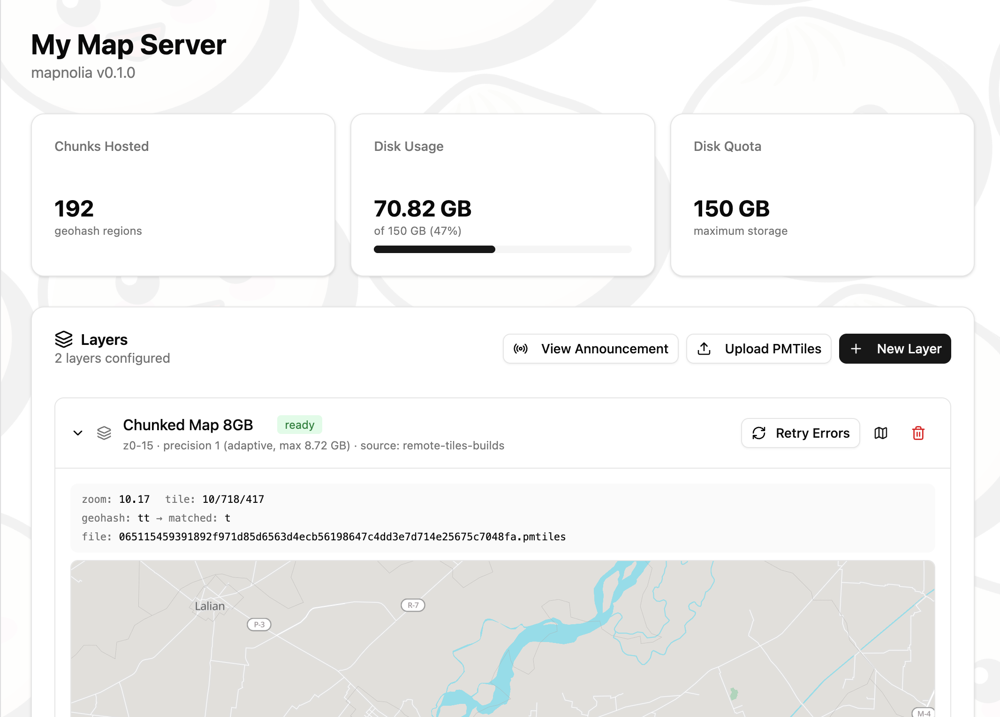
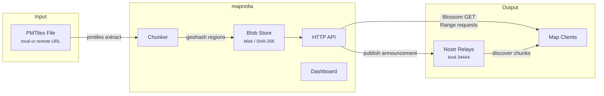
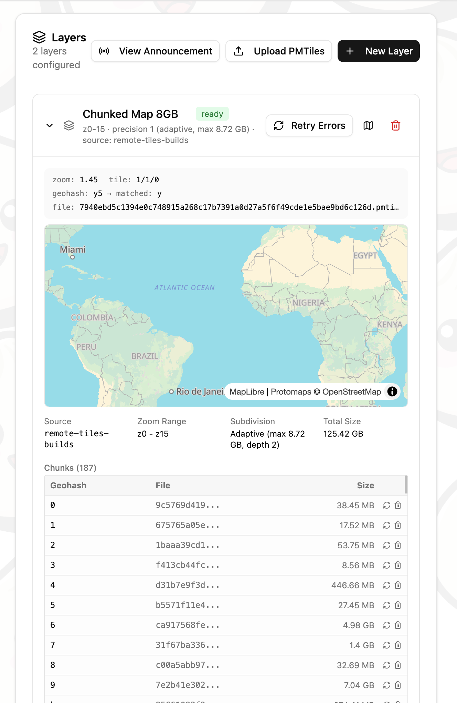
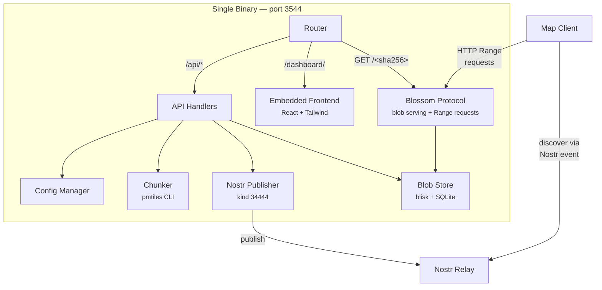
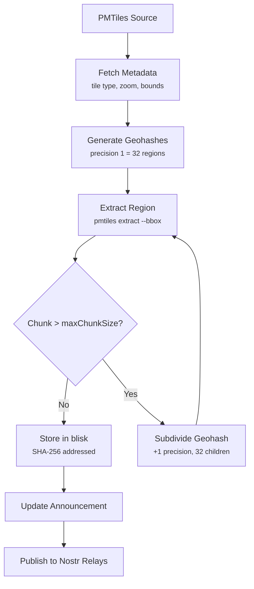
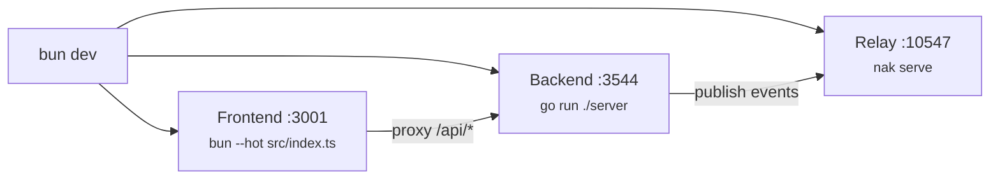

# mapnolia 🌍

Turn massive map tilesets into bite-sized, geographically chunked blobs — served over [Blossom](https://github.com/hzrd149/blossom) and discovered via [Nostr](https://nostr.com/).

mapnolia takes a [PMTiles](https://pmtiles.io/) archive, splits it into **geohash regions**, stores each chunk as a content-addressed blob, and publishes an index to Nostr relays. Clients fetch only the tiles they need for the area on screen.

- 🗺️ **Geohash chunking** — splits the world into regions, recursively subdivides large areas
- 📦 **Content-addressed storage** — every chunk is a standalone `.pmtiles` file identified by its SHA-256 hash
- 🌸 **Blossom protocol** — blobs served over HTTP with Range request support
- 📡 **Nostr discovery** — kind 34444 events announce the chunk index to any relay
- ⚡ **Single binary** — Go backend with embedded React dashboard, nothing else to deploy

<p align="center">
  
</p>

## How It Works



<p align="center">
  
</p>

## Getting Started

### Prerequisites

- [pmtiles CLI](https://github.com/protomaps/go-pmtiles/releases) — must be in `PATH` or `./bin/`

### 1. Download the release binary

```bash
mkdir mapnolia && cd mapnolia

# Download the latest release
curl -L -o mapnolia-server https://github.com/zeSchlausKwab/mapnolia/releases/latest/download/mapnolia-server-linux-amd64
chmod +x mapnolia-server

# Download pmtiles CLI
curl -L https://github.com/protomaps/go-pmtiles/releases/download/v1.22.3/go-pmtiles_1.22.3_Linux_x86_64.tar.gz | tar -xz pmtiles
mkdir -p bin && mv pmtiles bin/
```

### 2. Create a config file

```bash
cat > mapnolia.config.json << 'EOF'
{
  "name": "My Map Server",
  "adminPubkey": "",
  "about": "A Blossom server for PMTiles map data",
  "host": "0.0.0.0",
  "port": 3544,
  "baseURL": "https://blossom.example.com",
  "dataDir": "./data",
  "diskQuotaGB": 10,
  "privateKey": "",
  "relays": [
    "wss://relay.wavefunc.live"
  ]
}
EOF
```

Set `baseURL` to your server's public URL. You can leave `privateKey` empty — generate one from the dashboard after starting.

### 3. Run with pm2

```bash
npm i -g pm2
pm2 start ./mapnolia-server --name mapnolia
pm2 save
pm2 startup
```

### 4. Set up a reverse proxy

Example with [Caddy](https://caddyserver.com/) (auto-TLS):

```
blossom.example.com {
    reverse_proxy localhost:3544
}
```

All routes (Blossom blobs, API, dashboard) are handled by the single binary.

### 5. Open the dashboard

Go to `https://blossom.example.com/dashboard`. From there you can:

- Generate a Nostr keypair (if you left `privateKey` empty)
- Add PMTiles sources (local file paths or remote URLs)
- Create layers and start chunking
- Publish your chunk announcement to Nostr relays

### Docker

Alternatively, run with Docker:

```bash
git clone https://github.com/zeSchlausKwab/mapnolia.git mapnolia-src
cd mapnolia-src
docker build -t mapnolia .
cd ..

docker run -d \
  --name mapnolia \
  --restart unless-stopped \
  -p 3544:3544 \
  -v ./data:/data \
  -v ./mapnolia.config.json:/mapnolia.config.json \
  mapnolia
```

The Docker image includes the pmtiles CLI, so you don't need to install it separately.

### Build from Source

Requires [Go](https://go.dev/) 1.25+, [Bun](https://bun.sh/), and the [pmtiles CLI](https://github.com/protomaps/go-pmtiles/releases) in `PATH` or `./bin/`.

```bash
git clone https://github.com/zeSchlausKwab/mapnolia.git
cd mapnolia
cp mapnolia.config.example.json mapnolia.config.json
# Edit mapnolia.config.json — set baseURL, relays, etc.

bun install
bun run build:all
./bin/mapnolia-server
```

## Configuration

mapnolia looks for config files in this order:

1. `mapnolia.config.json` (current directory)
2. `../mapnolia.config.json`
3. `config.json`
4. `~/.config/mapnolia/config.json`

### Config Fields

| Field | Type | Default | Description |
|-------|------|---------|-------------|
| `name` | string | `"My Map Server"` | Server name shown in the dashboard and Nostr announcement |
| `about` | string | `""` | Server description |
| `picture` | string | `""` | Server avatar URL |
| `adminPubkey` | string | `""` | Nostr hex pubkey. If set, only this pubkey can access the dashboard. If empty, the dashboard is open to anyone. |
| `host` | string | `"0.0.0.0"` | Listen address |
| `port` | int | `3544` | Listen port |
| `baseURL` | string | `"http://localhost:3544"` | Public URL used in blob references and Nostr announcements. **Set this to your server's public URL.** |
| `dataDir` | string | `"./data"` | Directory for blob storage, downloads, and metadata |
| `diskQuotaGB` | float | `10` | Maximum disk usage in gigabytes for stored blobs |
| `privateKey` | string | `""` | Nostr private key (`nsec1...` or hex). Used to sign announcements. Can be generated from the dashboard. |
| `relays` | string[] | `[]` | Nostr relay URLs to publish announcements to |

### Environment Variables

All config values can be overridden with environment variables:

| Variable | Description | Default |
|----------|-------------|---------|
| `MAPNOLIA_HOST` | Listen address | `0.0.0.0` |
| `MAPNOLIA_PORT` | Listen port | `3544` |
| `MAPNOLIA_BASE_URL` | Public URL for blob references | `http://localhost:3544` |
| `MAPNOLIA_DATA_DIR` | Data storage directory | `./data` |
| `MAPNOLIA_PRIVATE_KEY` | Nostr private key (nsec or hex) | — |

## Architecture



### Chunking Process



The world is divided into **geohash regions** at a configurable precision level. Each region is extracted as a standalone PMTiles file using the `pmtiles` CLI. If a chunk exceeds `maxChunkSize`, it's recursively subdivided into finer geohashes up to `maxPrecision` depth.

## API

### Blossom Protocol

| Method | Path | Description |
|--------|------|-------------|
| `GET` | `/<sha256>.<ext>` | Download blob (supports HTTP Range requests) |
| `HEAD` | `/<sha256>.<ext>` | Check blob exists, get size |
| `PUT` | `/upload` | Upload blob (requires Nostr auth) |
| `DELETE` | `/<sha256>` | Delete blob (requires Nostr auth) |

### Management API

**Server:**

| Method | Path | Description |
|--------|------|-------------|
| `GET` | `/api/info` | Server metadata |
| `GET` | `/api/config` | Public configuration |
| `PATCH` | `/api/config` | Update server info |
| `GET` | `/api/stats` | Disk usage statistics |
| `GET` | `/api/chunks` | Current chunk announcement map |

**Sources (input PMTiles files):**

| Method | Path | Description |
|--------|------|-------------|
| `GET` | `/api/sources` | List all sources |
| `POST` | `/api/sources` | Add a new source |
| `PATCH` | `/api/sources/:id` | Update source URL or title |
| `POST` | `/api/sources/:id/refresh` | Re-fetch source metadata |
| `DELETE` | `/api/sources/:id` | Remove source |

**Layers (chunking configurations):**

| Method | Path | Description |
|--------|------|-------------|
| `GET` | `/api/layers` | List all layers |
| `POST` | `/api/layers` | Create a layer |
| `PATCH` | `/api/layers/:id` | Update layer title |
| `DELETE` | `/api/layers/:id` | Delete layer and its chunks |
| `POST` | `/api/layers/:id/chunk` | Start chunking process |
| `GET` | `/api/layers/:id/status` | Get chunking progress |
| `POST` | `/api/layers/:id/cancel` | Cancel chunking in progress |
| `POST` | `/api/layers/:id/chunks/:geohash/retry` | Retry failed chunk |
| `POST` | `/api/layers/:id/retry-errors` | Retry all failed chunks |
| `DELETE` | `/api/layers/:id/chunks/:geohash` | Delete specific chunk |

**Nostr:**

| Method | Path | Description |
|--------|------|-------------|
| `POST` | `/api/keypair` | Generate new Nostr keypair |
| `POST` | `/api/publish` | Publish announcement to relays |
| `GET` | `/api/announcement/preview` | Preview announcement event JSON |

## Nostr Announcement

mapnolia publishes a **kind 34444** parametrized replaceable event containing the chunk index:

```json
{
  "kind": 34444,
  "tags": [
    ["d", "mapnolia"],
    ["name", "My Map Server"],
    ["about", "PMTiles chunks served via Blossom"],
    ["r", "wss://relay.wavefunc.live"]
  ],
  "content": "{\"layers\":[{\"id\":\"basemap\",\"title\":\"OpenStreetMap Basemap\",\"kind\":\"chunked-vector\",\"blossomServer\":\"https://maps.example.com\",\"announcement\":{\"9\":{\"bbox\":[-135,0,-90,45],\"file\":\"9b4565...pmtiles\",\"maxZoom\":15,\"size\":7393300494}},\"defaultEnabled\":true,\"defaultOpacity\":1}]}"
}
```

Clients discover the announcement from Nostr relays, then fetch individual chunks from the Blossom server using HTTP Range requests — only downloading tiles for the geographic area being viewed.

## Development

### Prerequisites

- [Go](https://go.dev/) 1.25+
- [Bun](https://bun.sh/)
- [pmtiles CLI](https://github.com/protomaps/go-pmtiles) (must be in `PATH` or `./bin/`)

### Dev Server

```bash
# Install frontend dependencies
bun install

# Start all services (relay + backend + frontend with HMR)
bun dev
```

This starts three processes:

| Service  | URL                      | Description                    |
|----------|--------------------------|--------------------------------|
| Frontend | http://localhost:3001     | React dashboard with HMR       |
| Backend  | http://localhost:3544     | Go API + Blossom blob server    |
| Relay    | ws://localhost:10547      | Local Nostr relay (nak serve)   |



### Scripts

| Command | Description |
|---------|-------------|
| `bun dev` | Start all services (relay + backend + frontend) |
| `bun dev:frontend` | Frontend only with hot reload |
| `bun dev:backend` | Go backend only |
| `bun dev:relay` | Local Nostr relay only |
| `bun run build` | Build frontend to `server/dashboard/` |
| `bun run build:backend` | Compile Go binary to `bin/mapnolia-server` |
| `bun run build:all` | Build frontend then Go binary (single command) |

### Project Structure

```
mapnolia/
├── server/                  # Go backend
│   ├── main.go              # HTTP router, API handlers, Blossom hooks
│   ├── config.go            # Configuration loading and persistence
│   ├── chunker.go           # PMTiles extraction and geohash chunking
│   ├── nostr.go             # Nostr event signing and relay publishing
│   ├── dashboard.go         # Embedded frontend serving (go:embed)
│   └── dashboard/           # Built frontend assets (generated)
├── src/                     # Frontend source (React + Tailwind)
│   ├── index.html           # Entry point
│   ├── index.ts             # Dev server (Bun.serve with API proxy)
│   ├── frontend.tsx         # React app root
│   ├── components/
│   │   ├── Dashboard.tsx    # Main layout
│   │   ├── SourceManager.tsx # Sources, layers, and chunking UI
│   │   ├── ServerInfo.tsx   # Server configuration editor
│   │   └── Stats.tsx        # Disk usage display
│   └── lib/
│       └── api.ts           # TypeScript API client and types
├── scripts/
│   └── dev.ts               # Development environment orchestrator
├── build.ts                 # Frontend build script
├── mapnolia.config.example.json  # Example configuration
├── Dockerfile
└── package.json
```

### Data Storage

Chunks are stored in the data directory using [blisk](https://github.com/pippellia-btc/blisk), a content-addressed blob store backed by SQLite:

```
data/
├── blobs/              # Blob files (named by SHA-256 hash)
├── chunks/             # Temporary extraction workspace
├── downloads/          # Downloaded PMTiles source files
├── index.sqlite        # Blob metadata index
├── sources.json        # PMTiles source metadata
└── layers.json         # Layer configs and chunk mappings
```

### Releasing

Releases are built by GitHub Actions for `linux/amd64` and `linux/arm64` (CGO enabled for SQLite). There are two ways to trigger a release:

**From the GitHub UI** — go to Actions → Release → Run workflow, pick `patch`, `minor`, or `major`. The workflow computes the next version from the latest tag, creates the tag, builds, and publishes the release.

**Manual tag push:**

```bash
git tag v0.1.0
git push origin v0.1.0
```

## License

MIT
